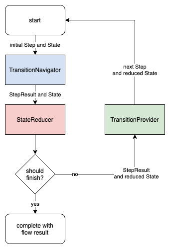
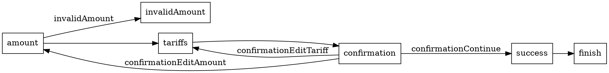
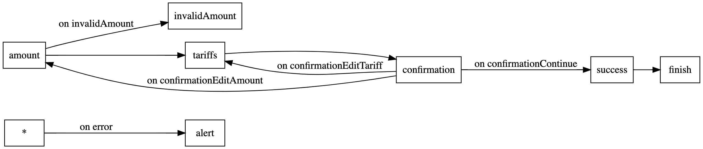

# FlowKit

Библиотека, позволяющая описывать [координаторы флоу](https://khanlou.com/2015/01/the-coordinator/) как [FSM](https://en.wikipedia.org/wiki/Finite-state_machine).

Особенности:

- Разделение ответственностей: реализация навигации, логика навигации и преобразование состояния описываются и могут быть протестированы независимо друг от друга.
- Отсутствие шареного состояния.
- Возможность стартовать флоу с любого экрана.
- Декларативность, DSL из коробки, генерация [описания графа флоу на языке DOT](https://en.wikipedia.org/wiki/DOT_(graph_description_language)) и вот это все :3
- Server-driven flow ready.

## Содержание

- [Концепция](#концепция)
  - [Step](#step)
  - [StepResult](#stepresult)
  - [State](#state)
- [Использование](#использование)
- [DSL](#dsl)
  - [Использование](#использование-1)
  - [Graphviz](#graphviz)

## Концепция

<p align="center">
    
</p>

Основная идея в вертикальном разделении ответственностей флоу:

- Реализация навигации (`TransitionNavigator`) – изменение дерева экранов.
- Логика навигации (`TransitionProvider`) – определение, на какой экран переходить дальше.
- Преобразование состояния (`StateReducer`) – трансформация данных по мере прохождение флоу и определение, когда данных достаточно для завершения флоу.

Эти компоненты асинхронны и оперируют такими сущностями, как `Step`, `StepResult`, `State`.

### Step

Шаги флоу. Фактически это экраны либо какие-то действия навигации.

Согласно шагу `TransitionNavigator` совершает переход на нужный экран.

### StepResult

Результаты шагов флоу. Либо данные, пришедшие от предыдущего экрана, либо какой-то флаг, говорящий о завершении шага.

По результату шага `StateReducer` создает новое состояние, а `TransitionProvider` определяет, какой переход совершить далее.

### State

Собранное из результатов предыдущих шагов состояние флоу. Т.е. это данные, собранные по мере прохождения флоу, и используемые либо в самом флоу, либо возвращаемые наружу при его завершении.

В отличие от шага и результата шага, состояние передается во все основные компоненты флоу: `TransitionNavigator`, `StateReducer`, `TransitionProvider`. Все они могут использовать состояние для корректной работы своей логики, но изменять состояние может только `StateReducer`.

## Использование

Определяем шаги флоу, результаты шагов, возможные состояния:

```swift
enum MyFlowStep {
    case amount
    case invalidAmount
    case tariffs
    ...
}

enum MyFlowStepResult {
    case amount(Int)
    case tariffs(Tariff)
    case confirmation(ConfirmationResult)
    ...
}

enum MyFlowState {
    case country(Country)
    case amount(Int, country: Country)
    case tariff(Tariff, amount: Int, country: Country)
    ...
}
```

Реализуем `TransitionNavigator`, `StateReducer` и `TransitionProvider`:

```swift
final class MyFlowTransitionNavigator: TransitionNavigator { ... }

final class MyFlowStateRecuer: StateReducer { ... }

final class MyFlowTransitionProvider: TransitionProvider { ... }
```

Собираем и стартуем флоу:

```swift
final class MyFlow {
    private lazy var transitionNavigator = MyFlowTransitionNavigator(...)
    private lazy var stateReducer = MyFlowStateRecuer(...)
    private lazy var transitionProvider = MyFlowTransitionProvider(...)

    private lazy var flow = Flow(transitionNavigator: transitionNavigator,
                                 stateReducer: stateReducer,
                                 transitionProvider: transitionProvider)

    func start(with country: Country) -> Promise<Transfer> {
        return flow.start(from: .amount, with: .country(country))
    }
}
```

[Пример реализации флоу](Sources/FlowKitExampleTransferFlowFeature/Flow)

## DSL

Вместо своей реализации `TransitionProvider`-а можно использовать уже существующий `DeclarativeTransitionProvider`, который позволяет описывать `TransitionProvider` с помощью DSL:

```swift
let dsl = FlowDSL {
    emit(using: emitter)
    step(.amount) {
        on(.invalidAmount) { forward(to: .invalidAmount) }
        next { forward(to: .tariffs) }
    }
    step(.tariffs) {
        next { forward(to: .confirmation) }
    }
    step(.confirmation) {
        on(.confirmationContinue) { forward(to: .success) }
        on(.confirmationEditAmount) { back(to: .amount) }
        on(.confirmationEditTariff) { back(to: .tariffs) }
    }
    step(.success) {
        next { forward(to: .finish) }
    }
}

let transitionProvider = DeclarativeTransitionProvider(flowDSL: dsl)

...
```

### Использование

Создаем билдер DSL, поддерживающий протокол `FlowDSLBuilder`:

```swift
final class MyFlowDSLBuilder: FlowDSLBuilder { ... }
````

Для описания реакции на изменение состояния используется тип, описывающий возможные события (`Event`), и функция-`emitter` этих событий.

Определяем тип `Event` внутри билдера:

```swift
final class MyFlowDSLBuilder: FlowDSLBuilder {
    enum Event {
        case invalidAmount
        case confirmationContinue
        case confirmationEditAmount
        case confirmationEditTariff
    }

    ...
}
```

Определяем `emitter` событий:

```swift
static func emitter(_ stepResult: MyFlowStepResult, _ state: MyFlowState) -> Event? {
    switch stepResult {
    case .amount(let amount) where amount < 100:
        return .invalidAmount
    case .confirmation(.continue, _):
        return .confirmationContinue
    case .confirmation(.editAmount, _):
        return .confirmationEditAmount
    case .confirmation(.editTariff, _):
        return .confirmationEditTariff
    default:
        return nil
    }
}
```

Описываем флоу, используя `emitter`:

```swift

let dsl = FlowDSL {
    emit(using: emitter)
    step(.amount) {
        on(.invalidAmount) { forward(to: .invalidAmount) }
        next { forward(to: .tariffs) }
    }
    ...
}

...
```

[Полный пример, где `FlowDSLBuilder` реализуется в самом `TransitionProvider`-е](Sources/FlowKitExampleTransferFlowFeature/Flow/TransferFlowTransitionProvider.swift)

### Graphviz

`DOTBuilder` позволяет конвертировать DSL в [язык описания графов DOT](https://en.wikipedia.org/wiki/DOT_(graph_description_language)) для последующей визуализации:

```swift
let dot = DOTBuilder()
let dsl = FlowDSL { ... }

dot.dsl(dsl)

print(dot.build())
```

Результат для флоу из примера:



Визуализация:


