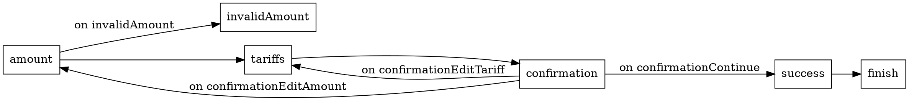

# FlowKit

A library that allows you to describe [flow coordinators](https://khanlou.com/2015/01/the-coordinator/) as [FSM](https://en.wikipedia.org/wiki/Finite-state_machine).

Features:

- Separation of responsibilities: navigation implementation, navigation logic and state transformation are described and can be tested independently of each other.
- No shared state.
- Ability to start a flow from any screen.
- Declarativity, DSL out of the box, generation of [flow graph description in the DOT language](https://en.wikipedia.org/wiki/DOT_(graph_description_language)).
- Server-driven flow ready.

## Table of Contents

- [Concept](#concept)
  - [Step](#step)
  - [StepResult](#stepresult)
  - [State](#state)
- [Usage](#usage)
- [DSL](#dsl)
  - [Declarations](#declarations)
  - [Graphviz](#graphviz)

## Concept

<p align="center">
    
</p>

The main idea is a vertical separation of responsibilities of the flow:

- Navigation implementation (`TransitionNavigator`) – changing the tree of screens.
- Navigation logic (`TransitionProvider`) – determining which screen to go next.
- State transformation (`StateReducer`) – transformation of data as the flow progresses and determining when there is enough data to complete the flow.

These components are asynchronous and operate with entities such as `Step`, `StepResult`, `State`.

### Step

Flow steps. In fact, these are screens or some kind of navigation actions.

According to the step the `TransitionNavigator` makes transition to the screen.

### StepResult

The results of the flow steps. Either the data that came from the previous screen, or some kind of flag indicating a completion of the step.

Based on the result of the step, the `StateReducer` creates a new state, and the `TransitionProvider` determines which transition to make next.

### State

The state of the flow collected from the results of the previous steps. I.e., this is the data collected as the flow progresses, and used either in the flow itself, or returned at its completion.

Unlike the step and the result of the step, the state is passed to all the main components of the flow: `TransitionNavigator`, `StateReducer`, `TransitionProvider`. All of them can use the state for their logic to work correctly, but only the `StateReducer` can change the state.

## Usage

Add a dependency:

```swift
.package(url: "https://github.com/madyanov/FlowKit.git", .upToNextMinor(from: "0.1.0")),
```

Determine the flow steps, the results of the steps and the possible states:

```swift
enum MyFlowStep {
    case amount
    case invalidAmount
    case tariffs
    ...
}

enum MyFlowStepResult {
    case amount(Int)
    case tariffs(Tariff)
    case confirmation(ConfirmationResult)
    ...
}

enum MyFlowState {
    case country(Country)
    case amount(Int, country: Country)
    case tariff(Tariff, amount: Int, country: Country)
    ...
}
```

Implement `TransitionNavigator`, `StateReducer` and `TransitionProvider`:

```swift
final class MyFlowTransitionNavigator: TransitionNavigator { ... }

final class MyFlowStateRecuer: StateReducer { ... }

final class MyFlowTransitionProvider: TransitionProvider { ... }
```

Create and start the flow:

```swift
final class MyFlow {
    private lazy var transitionNavigator = MyFlowTransitionNavigator(...)
    private lazy var stateReducer = MyFlowStateRecuer(...)
    private lazy var transitionProvider = MyFlowTransitionProvider(...)

    private lazy var flow = Flow(transitionNavigator: transitionNavigator,
                                 stateReducer: stateReducer,
                                 transitionProvider: transitionProvider)

    func start(with country: Country) -> Promise<Transfer> {
        return flow.start(from: .amount, with: .country(country))
    }
}
```

[Example of flow implementation](Sources/FlowKitExampleTransferFlowFeature/Flow)

## DSL

Instead of implementing the `TransitionProvider`, you can use the existing `DeclarativeTransitionProvider`, which allows you to describe the `TransitionProvider` using DSL:

```swift
let dsl = FlowDSL {
    emit(using: emitter)
    step(.amount) {
        on(.invalidAmount) { forward(to: .invalidAmount) }
        next { forward(to: .tariffs) }
    }
    step(.tariffs) {
        next { forward(to: .confirmation) }
    }
    step(.confirmation) {
        on(.confirmationContinue) { forward(to: .success) }
        on(.confirmationEditAmount) { back(to: .amount) }
        on(.confirmationEditTariff) { back(to: .tariffs) }
    }
    step(.success) {
        next { forward(to: .finish) }
    }
}

let transitionProvider = DeclarativeTransitionProvider(flowDSL: dsl)

...
```

### Usage

Create a DSL builder that implements the `FlowDSLBuilder` protocol:

```swift
final class MyFlowDSLBuilder: FlowDSLBuilder { ... }
````

To describe the state change reaction, the type defining possible events (`Event`) and the `emitter` function of these events are used.

Define the `Event` type inside the builder:

```swift
final class MyFlowDSLBuilder: FlowDSLBuilder {
    enum Event {
        case invalidAmount
        case confirmationContinue
        case confirmationEditAmount
        case confirmationEditTariff
    }

    ...
}
```

Define the event `emitter`:

```swift
static func emitter(_ stepResult: MyFlowStepResult, _ state: MyFlowState) -> Event? {
    switch stepResult {
    case .amount(let amount) where amount < 100:
        return .invalidAmount
    case .confirmation(.continue, _):
        return .confirmationContinue
    case .confirmation(.editAmount, _):
        return .confirmationEditAmount
    case .confirmation(.editTariff, _):
        return .confirmationEditTariff
    default:
        return nil
    }
}
```

Describe the flow using this `emitter`:

```swift

let dsl = FlowDSL {
    emit(using: emitter)
    step(.amount) {
        on(.invalidAmount) { forward(to: .invalidAmount) }
        next { forward(to: .tariffs) }
    }
    ...
}

...
```

[Complete example where `FlowDSLBuilder` is implemented in the `TransitionProvider`](Sources/FlowKitExampleTransferFlowFeature/Flow/TransferFlowTransitionProvider.swift)

### Declarations

- `step(Step) { ... }` – event handling for a specific step.
- `step { ... }` – event handling for *any* step.
- `on(Event) { ... }` – handle specific event.
- `next { ... }` – handle when no events were emitted.

### Graphviz

The `DOTBuilder` allows you to convert DSL to [the DOT graph description language](https://en.wikipedia.org/wiki/DOT_(graph_description_language)):

```swift
let dot = DOTBuilder()
let dsl = FlowDSL { ... }

dot.dsl(dsl)

print(dot.build())
```

Result for the example flow:



Visualization:


